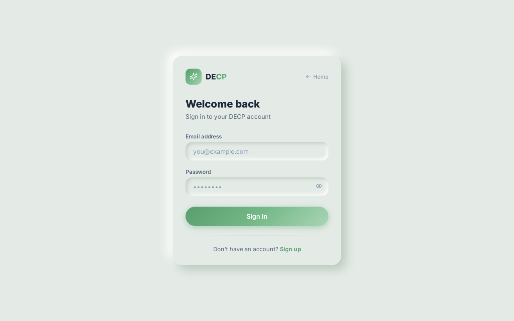
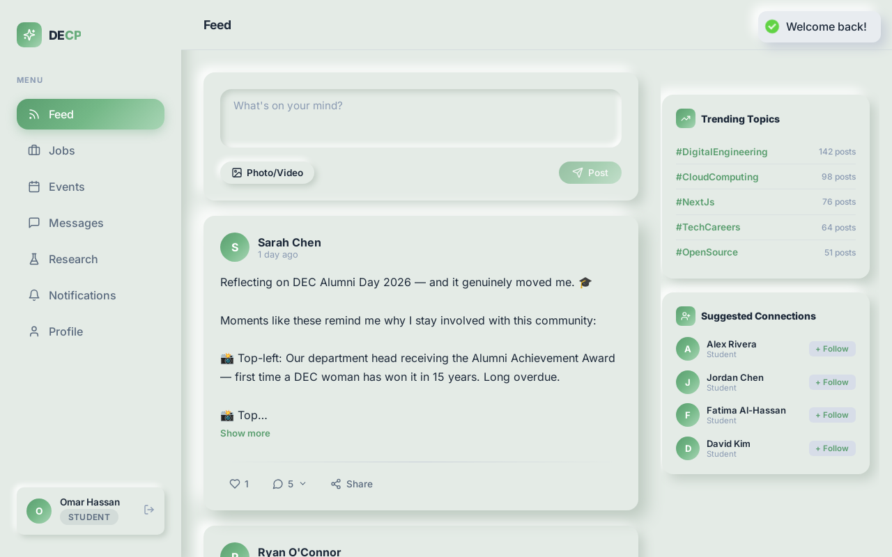
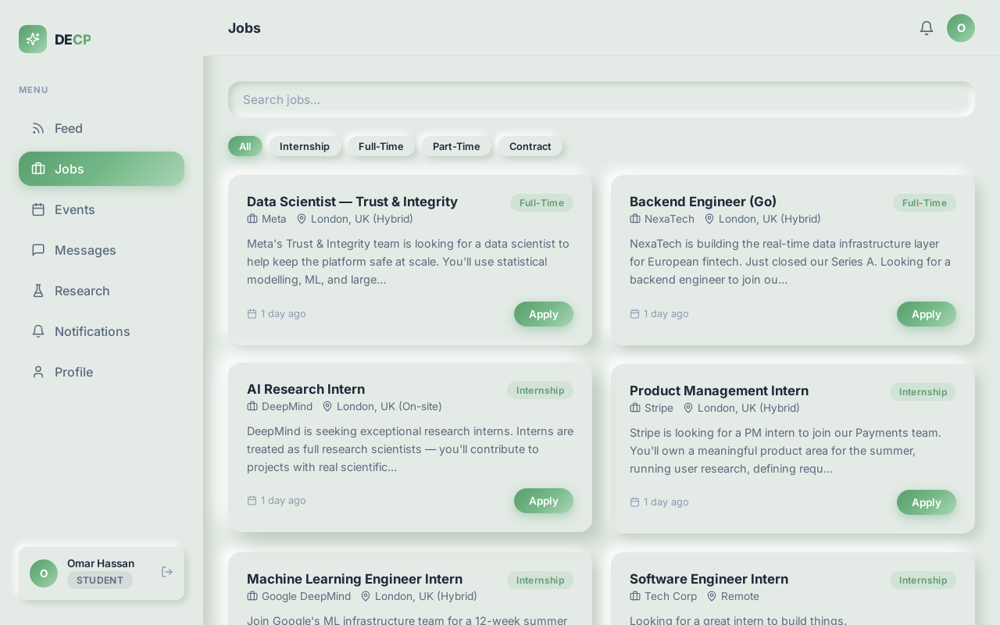
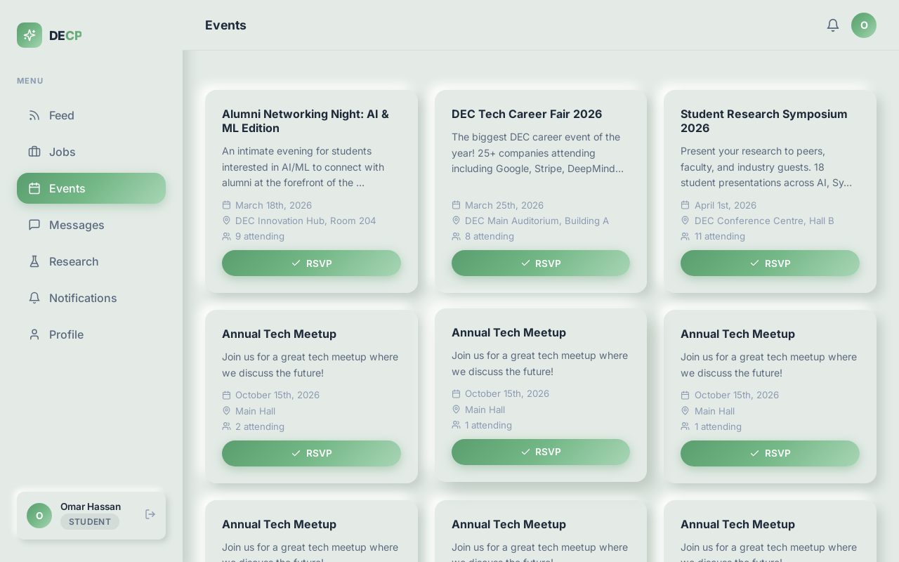
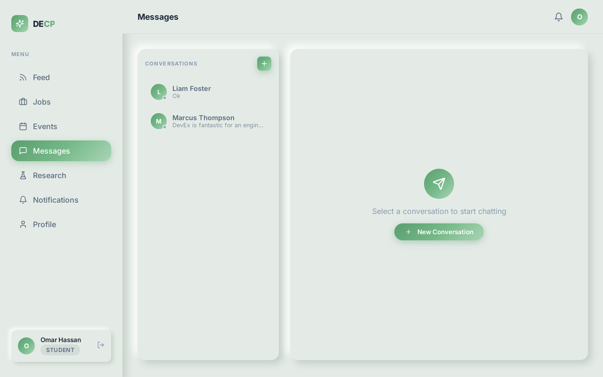
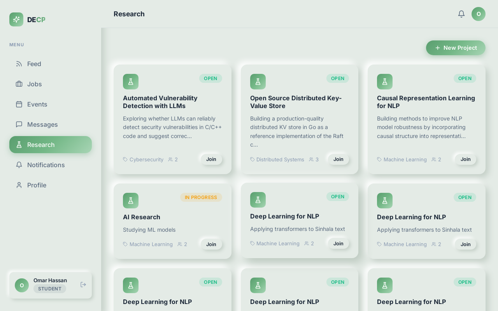
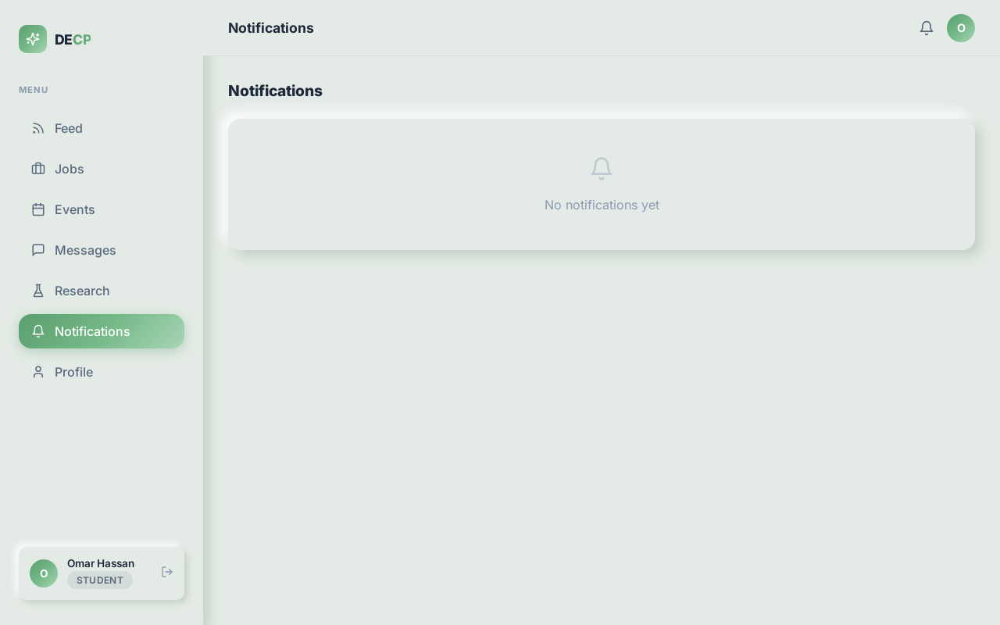
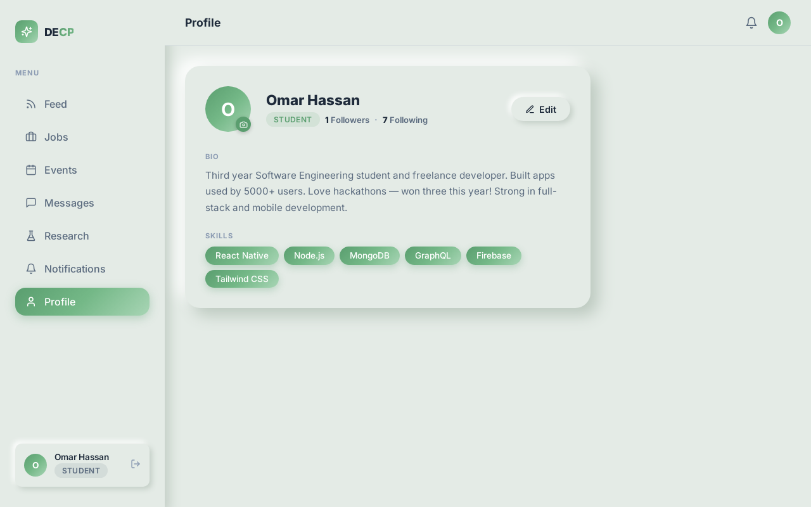

# DECP — Digital Engineering Community Platform

> **CO528 Applied Software Architecture — Mini Project**
>
> A production-grade microservices platform connecting engineering students, alumni, and industry professionals through a unified feed, job board, events, real-time messaging, research collaboration, and in-app notifications.

---

## Table of Contents

- [About the Platform](#about-the-platform)
- [Screenshots](#screenshots)
- [Architecture](#architecture)
- [Service Map](#service-map)
- [Tech Stack](#tech-stack)
- [Prerequisites](#prerequisites)
- [Running the Application](#running-the-application)
- [Seed Data / Demo Accounts](#seed-data--demo-accounts)
- [Running the Demo](#running-the-demo)
- [Project Structure](#project-structure)
- [Deployment](#deployment)

---

## About the Platform

DECP is a full-stack microservices application designed for university engineering departments. It gives students direct access to alumni networks, industry job opportunities, department events, and collaborative research — all in one place.

**Core features:**

| Feature | Description |
|---|---|
| **Feed** | Community posts with likes, comments, media uploads (Cloudflare R2), and real-time new-post notifications |
| **Jobs** | Job board with search and type filters; students apply with cover letters; alumni/admins post and manage applications |
| **Events** | Department events with RSVP / cancel RSVP; admin event creation |
| **Messages** | Real-time 1:1 chat with typing indicators, read receipts, online presence, and unread badges |
| **Research** | Collaborative research projects; join/leave; project status tracking |
| **Notifications** | Event-driven in-app alerts powered by GCP Pub/Sub (emulated); mark-all-read |
| **Profiles** | Avatar upload (R2), follower/following, view other users' profiles and posts |
| **Mobile** | Full-featured React Native / Expo app mirroring the web experience |
| **Real-time** | Socket.IO WebSocket service for live updates across all features |

---

## Screenshots

### Login


### Feed


### Jobs


### Events


### Messages


### Research


### Notifications


### Profile


---

## Architecture

DECP uses a **microservices architecture** with an **API Gateway** as the single public entry point. All inter-service communication uses internal HTTP calls (authenticated with an `x-internal-token` header) and an **asynchronous Pub/Sub event bus** for decoupled notifications and analytics.

```
                   ┌──────────────────────────────────────────┐
                   │              Client Layer                 │
                   │  Next.js Web (port 3100) | Expo Mobile    │
                   └─────────────────┬────────────────────────┘
                                     │ HTTPS / WebSocket
                   ┌─────────────────▼────────────────────────┐
                   │          API Gateway  :8082               │
                   │   JWT auth · CORS · Reverse proxy         │
                   └──┬──┬──┬──┬──┬──┬──┬──┬──┬──────────────┘
                      │  │  │  │  │  │  │  │  │
       ┌──────────────▼┐ │  │  │  │  │  │  │  └────────────────┐
       │  Auth   :3001  │ │  │  │  │  │  │  │          ┌────────▼──────┐
       └───────────────┘ │  │  │  │  │  │  │          │ Realtime :3010 │
       ┌─────────────────▼┐ │  │  │  │  │  │          │  Socket.IO     │
       │  User     :3002  │ │  │  │  │  │  │          └───────────────┘
       └──────────────────┘ │  │  │  │  │  │
       ┌────────────────────▼┐ │  │  │  │  │
       │  Feed       :3003   │ │  │  │  │  │
       └─────────────────────┘ │  │  │  │  │
       ┌───────────────────────▼┐ │  │  │  │
       │  Jobs         :3004    │ │  │  │  │
       └────────────────────────┘ │  │  │  │
       ┌──────────────────────────▼┐ │  │  │
       │  Events         :3005     │ │  │  │
       └───────────────────────────┘ │  │  │
       ┌─────────────────────────────▼┐ │  │
       │  Messaging        :3006      │ │  │
       └──────────────────────────────┘ │  │
       ┌────────────────────────────────▼┐ │
       │  Notification       :3007       │ │
       └─────────────────────────────────┘ │
       ┌────────────────────────────────── ▼┐
       │  Research / Analytics  :3008-3009   │
       └─────────────────────────────────────┘
                      │
       ┌──────────────▼──────────────────────┐
       │  GCP Pub/Sub Emulator  :8085        │
       │  MongoDB               :27017       │
       │  Cloudflare R2         (live)       │
       └─────────────────────────────────────┘
```

**Key architectural patterns:**

- **API Gateway** — single public entry point; validates JWT and injects `x-user-id` / `x-user-role` headers for all downstream requests
- **Pub/Sub event bus** — services publish domain events (e.g. `new_message`, `new_post`); Notification and Analytics services subscribe independently
- **Realtime fanout** — any service calls `POST http://realtime:3010/emit` with `{userId, event, payload}`; the realtime service delivers via Socket.IO to the correct connected client
- **Presigned R2 uploads** — browser uploads media directly to Cloudflare R2 (zero gateway bandwidth); service validates existence with `HeadObjectCommand` before persisting post
- **Shared internal libraries** — `lib/internalClient.js` (axios + `x-internal-token`) and `lib/pubsub.js` are shared across all services

---

## Service Map

| Container | Host Port | Responsibility |
|---|---|---|
| `decp-gateway` | **8082** | API Gateway — auth, CORS, reverse proxy |
| `decp-auth` | 3001 | Register, login, JWT access + refresh tokens, logout |
| `decp-user` | 3002 | User profiles, avatar (R2), search, follow/unfollow |
| `decp-feed` | 3003 | Posts, likes, comments, media upload (R2) |
| `decp-jobs` | 3004 | Job listings, applications, accept/reject |
| `decp-events` | 3005 | Events, RSVPs |
| `decp-messaging` | 3006 | 1:1 messages, read receipts, inbox |
| `decp-notification` | 3007 | In-app notifications (Pub/Sub driven) |
| `decp-analytics` | 3008 | Platform metrics (Pub/Sub driven) |
| `decp-research` | 3009 | Research projects, memberships |
| `decp-realtime` | 3010 | WebSocket hub (Socket.IO) |
| `decp-mongodb` | 27018 | MongoDB (shared data store) |
| `decp-pubsub` | 8085 | GCP Pub/Sub emulator |

---

## Tech Stack

| Layer | Technology |
|---|---|
| Web frontend | Next.js 14 (App Router), TypeScript, Zustand, TanStack Query, Socket.IO client |
| Mobile | React Native, Expo Router, TypeScript |
| Backend services | Node.js 18, Express |
| Database | MongoDB (Mongoose ODM) |
| Event bus | GCP Pub/Sub (emulated via `gcr.io/google.com/cloudsdktool/cloud-sdk:emulators`) |
| Real-time | Socket.IO over WebSocket |
| Media storage | Cloudflare R2 (live, presigned PUT uploads) |
| API Gateway | Express reverse proxy with JWT middleware |
| Containerisation | Docker, Docker Compose |
| CI/CD | GitHub Actions → SSH deploy to AWS EC2 |

---

## Prerequisites

- [Node.js](https://nodejs.org/) v18+
- [Docker](https://www.docker.com/) + Docker Compose v2
- [npm](https://www.npmjs.com/) (bundled with Node.js)

---

## Running the Application

### 1. Clone the repository

```bash
git clone https://github.com/cepdnaclk/co528-Mini-Project-DEC-Platform.git
cd co528-Mini-Project-DEC-Platform
```

### 2. Configure environment variables

```bash
cp docker-compose.example.env docker-compose.env
# Edit docker-compose.env — add your Cloudflare R2 credentials
```

### 3. Start all backend services

```bash
docker compose --env-file docker-compose.env up -d --build
```

Verify all 13 containers are running:

```bash
docker compose ps
```

### 4. Initialise Pub/Sub topics

Run once after first boot:

```bash
node scripts/setup-pubsub.js
```

### 5. (Optional) Seed sample data

Populates 15 users, 20 posts, 5 jobs, 3 events, 3 research projects, and 54 messages:

```bash
node scripts/populate.js
node scripts/populate-phase2.js
node scripts/populate-messages.js
```

### 6. Start the web frontend

```bash
cd web
npm install
npm run dev        # http://localhost:3100
```

### 7. (Optional) Start the mobile app

```bash
cd mobile
npm install
npx expo start
# Scan the QR code with Expo Go on your device
```

---

## Seed Data / Demo Accounts

All seed accounts use the password **`Pass1234`**.

| Name | Email | Role |
|---|---|---|
| Sarah Chen | sarah.chen@decp.io | Alumni |
| Marcus Thompson | marcus.thompson@decp.io | Alumni |
| Omar Hassan | omar.hassan@decp.io | Student |
| Liam Foster | liam.foster@decp.io | Student |
| Fatima Al-Hassan | fatima.al-hassan@decp.io | Student |
| Admin | admin@decp.io | Admin |

> Alumni and Admin roles can post jobs and create events. Student roles can apply for jobs and RSVP to events.

---

## Running the Demo

A Playwright E2E demo walks through all 8 sections of the platform in a headed browser (~40 seconds). It cleans up all created data afterwards — fully **idempotent**, safe to run repeatedly.

**Requirements:** backend running (`docker compose up -d`) + web app running (`cd web && npm run dev`).

```bash
./run-demo.sh
```

Playwright and Chromium are installed automatically if not already present.

**Demo walkthrough:**

| Step | What happens |
|---|---|
| 1. Login | Signs in as Omar Hassan |
| 2. Feed | Creates a post, likes an existing post |
| 3. Jobs | Browses listings, submits a job application |
| 4. Events | RSVPs to a department event |
| 5. Research | Joins a research project |
| 6. Messages | Sends 3 messages to Liam Foster (visible live on mobile) |
| 7. Notifications | Views the notifications panel |
| 8. Profile | Views the user profile page |
| Cleanup | Deletes all created data via API |

**To see real-time messaging on mobile during the demo:**
Log in as `liam.foster@decp.io` / `Pass1234` and open the Messages tab — Omar's messages will arrive live.

---

## Project Structure

```
co528-Mini-Project-DEC-Platform/
├── gateway/                   # API Gateway (Express)
│   └── src/
│       ├── middleware/        # JWT auth, CORS, rate limiting
│       └── routes/            # Proxy route definitions
├── services/
│   ├── auth/                  # JWT register/login/refresh/logout
│   ├── user/                  # Profiles, avatar, follow/unfollow, search
│   ├── feed/                  # Posts, likes, comments, R2 media
│   ├── jobs/                  # Job board + application management
│   ├── events/                # Events + RSVPs
│   ├── messaging/             # 1:1 chat, read receipts, inbox
│   ├── notification/          # In-app notifications (Pub/Sub subscriber)
│   ├── analytics/             # Platform metrics (Pub/Sub subscriber)
│   ├── research/              # Research projects + memberships
│   └── realtime/              # Socket.IO hub + presence tracking
├── web/                       # Next.js 14 web app (port 3100)
│   └── src/
│       ├── app/               # App Router pages
│       ├── components/        # Shared UI components
│       ├── lib/               # API client, socket client
│       ├── store/             # Zustand auth store
│       └── styles/            # Global CSS
├── mobile/                    # React Native / Expo app
│   └── app/
│       ├── (auth)/            # Login, register screens
│       └── (app)/             # Feed, Jobs, Events, Messages, etc.
├── scripts/
│   ├── setup-pubsub.js        # Create Pub/Sub topics + subscriptions
│   ├── populate.js            # Seed users, posts, follows
│   ├── populate-phase2.js     # Seed jobs, events, research
│   ├── populate-messages.js   # Seed conversations
│   ├── demo.js                # Playwright demo script
│   └── generate_report.py     # Generate CO528 architecture report
├── docs/
│   ├── screenshots/           # UI screenshots (used in this README)
│   ├── report/                # CO528 architecture report (.docx)
│   ├── API_CONTRACT.md        # Full API reference
│   └── CLOUD_DEPLOYMENT.md    # EC2 + GitHub Actions deployment guide
├── run-demo.sh                # One-command demo runner
├── docker-compose.yml         # Full service orchestration
└── docker-compose.example.env # Environment variable template
```

---

## Deployment

The platform is designed to deploy on a single **AWS EC2 t3.medium** instance (4 GB RAM) using Docker Compose. A GitHub Actions workflow SSH-deploys on every push to `main`.

```
GitHub push → GitHub Actions → SSH to EC2 → git pull → docker compose up -d --build
```

- MongoDB runs as a Docker container on the same instance (~1,862 MB total RAM across all containers, ~2,134 MB headroom)
- All secrets managed via GitHub Actions secrets, injected as environment variables at deploy time

See [`docs/CLOUD_DEPLOYMENT.md`](docs/CLOUD_DEPLOYMENT.md) for the complete setup guide including required secrets, EC2 configuration, and cost estimates.
